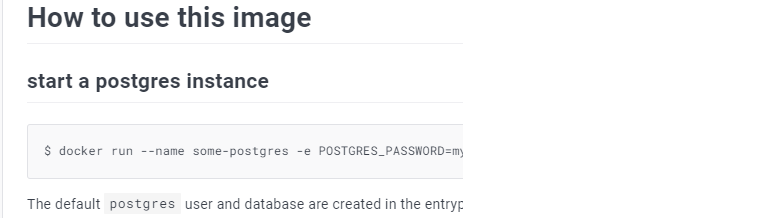

# DOCKER

Un nuevo programador llega a la empresa:

* Se le pide instalar herramientas con **versiones específicas**
* Supongamos que el desarrollador tiene dos computadoras, una tiene linux y la otra es windows
* Ahora tenemos otro problema, en la empresa tenemos dos app, y ambas usan versiones diferentes

## Virtual Machines

* PESADAS
  * Emulamos la capa de aplicaciones y el kernel del sistema operativo
* LENTAS
  * Cambiarlas, iniciarlas, ejecutarlas, transferirlas

## CON DOCKER

Nos permite usar imagenes:
* Imagenes propias
* Imagenes de terceros

Yo podría crear containers que tengan las versiones de mis herramientas con las que trabajo

* Instalar herramientas y las versiones específicas


**BENEFICIOS**

A diferencia de las máquinas virtuales, los contenedores se levantan en milésimas de segundo a unos cuantos segundos
* Cada contenedor esta aislado de los demás
* Es posible ejecutar varias instancias de la misma versión o diferentes versiones sin configuraciones adicionales
* Con un comando, puedes descargar, levantar y correr todo lo que necesitas
* Cada contenedor contiene todo lo que necesita para ejecutarse
* Indiferente el sistema operativo HOST

**FLUJO DE TRABAJO**

MONGO, EXPRESS, NODEJS NEST

BUILD PROCESS, AUTOMATIZAR MEDIANTE GIT Y JENKINS (ESTA INSTALADO TODO, HERRAMIENTAS Y SISTEMA)

PUSH (Subir a un repositorio, es igual que git, pero este esta optimizado para aceptar contenedores)

Cuando queremos desplegar a un servidor este se encarga de hacer un PULL a ese repositorio
 

## 16. Variables de entorno

Son variables que existen en un entorno(contenedor), cuando tenemos multiples contenedores podemos tener variables de entorno globales.

- Son utiles cuando mandamos configuraciones a la hora de levantar un contenedor

```docker
docker run -d `
  --network todo-app --network-alias mysql `
  -v todo-mysql-data:/data/var/lib/mysql `
  -e MYSQL_ROOT_PASSWORD=secret `
  -e MYSQL_DATABASE=todos `
  mysql:8.0
```
-e: Variable de entorno: MySQL necesita definir el password y el nombre de la base de datos.

Ejercicio:
1. Ir a https://hub.docker.com/
2. Buscar Postgres
3. Ejecutar el `docker pull postgres`
  
4. Se puede ver las variables de entorno
5. docker run --name some-postgres -e POSTGRES_PASSWORD=mysecretpassword -d postgres

## 17. Usar la imagen de postgres

1. docker container ls > Nos mostrará que postgres esta corriendo en el puerto 5432
2. Abrir TablePlus.exe, cuando tratemos de hacer la conexion nos dara error
   1. username: postgres
   2. password: mysecretpassword
   3. database: 
   4. servidor: localhost
   5. port: 5432
3. docker container ls
4. docker container rm -f "hash"
5. docker run --name some-postgres -e POSTGRES_PASSWORD=mysecretpassword -dp 5432:5432 postgres
6. Ahora si volvemos a hacer un test de conexion en el TablePlus veremos que si nos esta funcionando
7. Finalmente lo borramos: docker container rm -f "hashh"

## 18. Multiples instancias en postgres

Queremos dos instancias de postgres en versiones diferentes corriendo en la PC en puertos diferentes

1. Crear dos instancias del postgres 
  1. docker container run --name postgres-alpha -e POSTGRES_PASSWORD=mypass1 -dp 5432:5432 postgres
  2. docker container run --name postgres-alpha -e POSTGRES_PASSWORD=mypass1 -dp 5432:5432 postgres
2. Tener en cuenta que deben de tener nombres diferentes, y deben estar en ports diferentes tambien
3. por ultimo borrar los containers: docker container rm -f f24 d4f

## 19. Logs del contenedor

Los logs es informacion que la imagen dentro de nuestro contenedor esta emitiendo
```
docker container logs <container id>
docker container logs --follow <container id>
```
el -f se usa para darle seguimiento al log
**TAREA**

1. Montar la base de datos MARIADB con el siguiente comando
  ```code
  docker container run `
  -e MARIADB_RANDOM_ROOT_PASSWORD=yes
  -dp 3306:3306
  mariadb:jammy` 
  ```
2. Obtener el listado de los contenedores activos
3. Ejecutar el comando
  ```
  docker container logs <ID del contenedor> 
  ```
4. Identificar cuál es el password del usuario root en los logs (GENERATED ROOT PASSWORD)
5. Conectarse a MariaDB desde TablePlus user: root pass: El password aleatorio generado

Haciendo la tarea encontre:
```code
2023-11-29 12:32:08+00:00 [Note] [Entrypoint]: GENERATED ROOT PASSWORD: ^qPP7w--I!cd(,B_j+MSv2@`nEMz872|
```
El user es root

## 20. Tarea: Borrar todas las imágenes de Postgres

1. docker container rm -f "hashes"
2. docker image ls
3. docker image rm "hash"

A veces se tiene que eliminar de forma forzada: docker image rm -f "hash_image"

# SECCIÓN 3: VOLUMES & NETWORK

Nos enfocaremos en hacer persistente la informacion que graban nuestros contenedores.

Lo que pasa es que cuando nosotros eliminamos el contenedor, nuestros datos que creamos son borrados, a veces puede que esto nos sirva pero habra ocasiones en las que no vamos a querer que se borren, entonces como hacemos esto:
1. Tomar la información donde la graba y la vamos a reflejar en otro lugar que se va a llamar `Volumen`

Temas puntuales de la sección
Esta sección empieza a ponerse más interesante con los siguientes temas:

* Terminal interactiva dentro del contenedor
* Aplicaciones con múltiples contenedores
* Redes
* Volúmenes
* Mapeo de directorios y relaciones
* Montar un servidor Apache con PHPMyAdmin junto a MariaDB
* Revisar el file system de alpine y node
Esta sección empieza a dejar bases para el uso de los contenedores a otro nivel.

## 23. Ejercicio sin volumenes - Montar Base de datos

**Ejercicio**
1. Montar la imagen de MariaDB con el tag jammy, publicar en el puerto 3306 del contenedor con el puerto 3306 de nuestro equipo, colocarle el nombre al contenedor de __world-db__ (--name world-db) y definir las siguientes variables de entorno:
    * MARIADB_USER=example-user
    * MARIADB_PASSWORD=user-password
    * MARIADB_ROOT_PASSWORD=root-secret-password
    * MARIADB_DATABASE=world-db

2. Conectarse usando Table Plus a la base de datos con las credenciales del usuario (NO EL ROOT)
3. Conectarse a la base de datos ```world-db```
4. Ejecutar el query de creación de tablas e inserción proporcionado
5. Revisar que efectivamente tengamos la data

```
docker container run --name world-db -e MARIADB_USER=example-user -e MARIADB_PASSWORD=user-password -e MARIADB_ROOT_PASSWORD=root-secret-password -e MARIADB_DATABAS
E=world-db -dp 3306:3306 mariadb:jammy
```

## 24. Tipos de Volúmenes

* **Named Volumes**

Este es el volumen mas usado

Crear un nuevo volumen
```code
docker volume create todo-db
```

Listar los volúmenes creados
```code
docker volume ls
```

Inspeccionar el volumen específico
```code
docker volume inspect todo-db
```

Remueve todos los volúmenes no usados
```code
docker volume rm VOLUME_NAME
```

Usar el volumen al correr contenedor
```code
docker run -v todo-db:/etc/todos getting-started
```


* **Bind Volumes - Vincular volúmenes**
Bind volumes trabaja con paths absolutos
```code
docker run -db 3000 \
  -w /app -v "$(pwd):/app" \
  node:18-alpine \
  sh -c "yarn install && yarn run dev"
```
Powershell
```
docker run -db 3000 `
  -w /app -v "$(pwd):/app" `
  node:18-alpine `
  sh -c "yarn install && yarn run dev"
```
`-w/app` **Working directory**: donde el comando empezará a correr

`-v "$(pwd):/app"` **Volumen vinculado**: vinculamos el directorio del host con el directorio /app del contenedor

`node:18-alpine` **Imagen a usar**

`sh -c "yarn install && yarn run dev"`: **Comando Shell** Iniciamos un shell y ejecutamos **yarn install** y luego correr el yarn run dev

* **Anonymous Volumes**
Volúmenes donde sólo se especifica el path del contenedor y docker lo asigna automáticamente en el host
```
docker run -v /var/lib/mysql/data
```
* 


